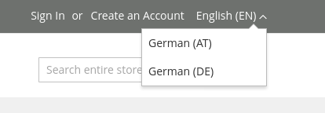
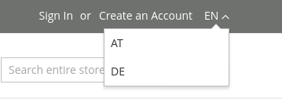

# IMI StoreSwitch

[](https://packagist.org/packages/imi/magento2-store-switch-all-store-views)
[](https://packagist.org/packages/imi/magento2-store-switch-all-store-views)

This Magento module extends the default store switcher and displays all store views, regardless of the store or website 
they're associated to.
The default magento store switcher only show the store views which are associated to the currently active store.

It extends the core store switch `Magento\Store\Block\Switcher`.  
By passing `\IMI\StoreSwitch\ViewModel\StoreSwitchModel` as an argument to the Switcher Block and using the `IMI_StoreSwitch::switch/languages.phtml` template you can switch between all stores of all websites.

It is possible to enable or disabled the switcher in default, website and store scope. The corresponding acl resource is `IMI_StoreSwitch::config`.

The switcher is disabled by default, it can be enabled with the config value `imi_store_switch/general/enable` or in 
the admin configuration on `Stores > iMi > Store Switch`.

### Show country code only or country code and name

By default the store switcher looks like this: 



There is also an option to only show the country code in the store view.
If enabled, the available options will only display the country code, otherwise the name and country code are shown.

With the option enabled, it looks like this:



# Installing

The easiest way to install the module is from [packagist](https://packagist.org/packages/imi/magento2-store-switch-all-store-views) by running

```bash
composer require imi/magento2-store-switch-all-store-views
bin/magento module:enable IMI_StoreSwitch
bin/magento setup:upgrade
bin/magento cache:flush
```

If you're running this on a shop in production mode, run 

```bash
bin/magento setup:static-content:deploy
bin/magento cache:flush
```
## Porto Theme

This has partial support for the Porto Theme, without warranty.

You might want to try this layout update in `default.xml` of your child theme:

```
<page xmlns:xsi="http://www.w3.org/2001/XMLSchema-instance" xsi:noNamespaceSchemaLocation="../../../../../../../lib/internal/Magento/Framework/View/Layout/etc/page_configuration.xsd">
    <body>
        <referenceContainer name="porto_header">
            <block class="Magento\Store\Block\Switcher" name="store_language" as="store_language" template="IMI_StoreSwitch::switch/languages-porto.phtml">
                <arguments>
                    <argument name="view_model" xsi:type="object">IMI\StoreSwitch\ViewModel\StoreSwitchModel</argument>
                </arguments>
            </block>
        </referenceContainer>
    </body>
</page>
```

# License

© 2020 iMi digital GmbH. Licensed under [MIT](LICENSE).
